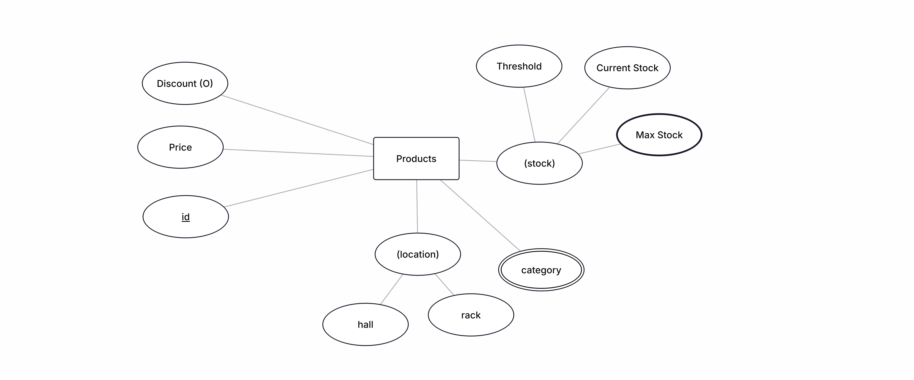
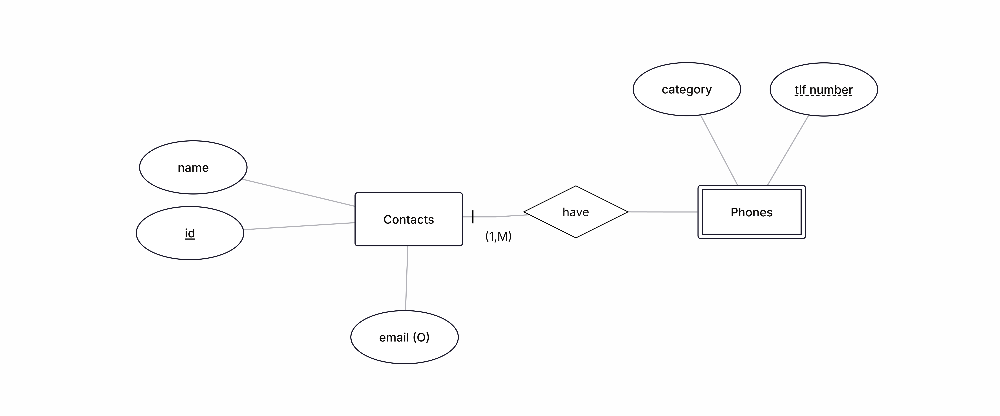
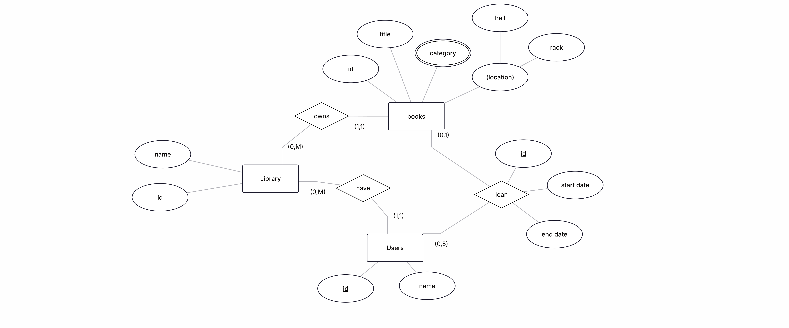

# Sheet01 - Ejercicios de Diagramas ER
## ex01 - Inventario Simple
En una pequeña tienda se desea llevar un control del inventario de productos
disponibles. De cada producto interesa conocer toda la información relevante
para la gestión y saber cuántos hay en stock.

## ex02 - Agenda de contactos
Se quiere crear una agenda de contactos personales. Una misma persona
puede tener varios números de teléfono (móvil, trabajo y casa), pero cada
número pertenece a una sola persona. También se almacena el correo
electrónico si lo hubiera.

## ex03 - Biblioteca
Una biblioteca pública necesita gestionar los libros que posee y el registro de
préstamos a usuarios. Debe poder consultar en cualquier momento qué usuario
tiene qué libro y cuándo debe devolverlo.

